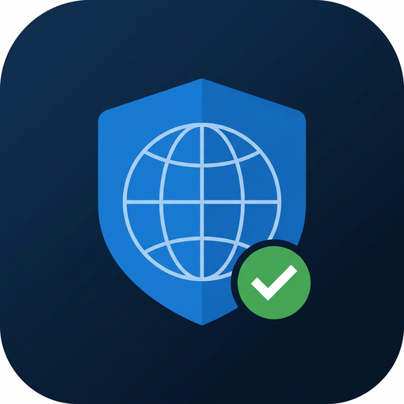

# 🛡️ Shield Browser (শিল্ড ব্রাউজার)

**Android-এর জন্য একটি শক্তিশালী অ্যাড-ব্লকিং ব্রাউজার** — যেকোনো সাধারণ মোবাইল
ব্রাউজারের চেয়ে অনেক বেশি শক্তিশালী অ্যাড-ব্লকার, সাথে **YouTube ব্যাকগ্রাউন্ড
প্লে** সুবিধা।



---

## ✨ প্রধান ফিচার

| ফিচার | বিবরণ |
|---|---|
| 🛡️ **মাল্টি-লেয়ার অ্যাড-ব্লকিং** | ৪টি স্বাধীন লেয়ারে অ্যাড/ট্র্যাকার/ম্যালওয়্যার ব্লক |
| 🌐 **~১,৩০,০০০+ ব্লকড ডোমেইন** | StevenBlack `hosts` + EasyList অ্যাড-সার্ভার ডোমেইন — O(1) lookup |
| 📜 **EasyList + EasyPrivacy নেটওয়ার্ক রুল** | ~৬০,০০০ ABP ফরম্যাট রুল, `@@` এক্সেপশন, `$third-party`, `domain=` সাপোর্টসহ |
| 🎭 **কসমেটিক (এলিমেন্ট হাইডিং) ফিল্টারিং** | ~৩৮,০০০ সিলেক্টর — পেজ থেকে অ্যাডের ফাঁকা ঘর মুছে দেয়, কুকি-ব্যানারসহ |
| 🚫 **পপ-আপ ব্লকার** | ইউজার-জেসচার ছাড়া `window.open`/`target=_blank` ব্লক + কাউন্টার |
| ▶️ **YouTube ব্যাকগ্রাউন্ড প্লে** | স্ক্রিন বন্ধ বা অ্যাপ মিনিমাইজ করলেও অডিও/ভিডিও চলতে থাকবে |
| ⏭️ **YouTube অ্যাড স্কিপার** | ইন-স্ট্রিম ভিডিও অ্যাড মিউট + ফাস্ট-ফরোয়ার্ড + অটো-স্কিপ, এনফোর্সমেন্ট পপ-আপ রিমুভার |
| ⬇️ **YouTube ভিডিও ডাউনলোডার** | মেনু → "ভিডিও ডাউনলোড" — ১৪৪p–4K পর্যন্ত কোয়ালিটি বেছে সরাসরি ডাউনলোড (অডিওসহ/নীরব/শুধু-অডিও) |
| 🔌 **এক্সটেনশন সাপোর্ট** | Firefox/Tampermonkey-স্টাইল ইউজারস্ক্রিপ্ট — Greasyfork থেকে এক ট্যাপে ইনস্টল |
| 🗂️ **মাল্টি-ট্যাব ব্রাউজিং** | ট্যাব স্যুইচার, বুকমার্ক, হিস্টোরি, ডাউনলোড সাপোর্ট |
| ⛶ **ফুলস্ক্রিন ভিডিও**, 🖥️ **ডেস্কটপ মোড**, 🔍 **৪টি সার্চ ইঞ্জিন** | Google / DuckDuckGo / Bing / Brave |
| 🔄 **ফিল্টার অটো-আপডেট** | সেটিংস থেকে এক ট্যাপে সর্বশেষ EasyList/StevenBlack লিস্ট ডাউনলোড |
| 🚫 থার্ড-পার্টি কুকি/ট্র্যাকার কাউন্টার | "শিল্ড পরিসংখ্যান" ডায়ালগে পেজ-ভিত্তিক ব্লক রিপোর্ট |

---

## 🏗️ অ্যাড-ব্লকিং আর্কিটেকচার (কীভাবে এত শক্তিশালী?)

```
রিকোয়েস্ট
   │
   ├─► [লেয়ার ১] ডোমেইন সেট (HashSet, ~১.৩ লাখ)      ← O(1), হোস্ট+প্যারেন্ট সফিক্স ওয়াক
   │        StevenBlack/hosts (৭৮k) + EasyList adservers (৫১k)
   │
   ├─► [লেয়ার ২] এক্সেপশন রুল (@@)                    ← হোয়াইটলিস্ট, `$document/type/domain`
   │
   ├─► [লেয়ার ৩] প্যাটার্ন রুল (regex)                ← n-gram টোকেন ইনডেক্স — প্রতি রিকোয়েস্টে
   │        প্রায় কোনো রেজেক্সই চালাতে হয় না, তাই এটি দ্রুত
   │
   └─► [লেয়ার ৪] কসমেটিক ফিল্টার                     ← পেজ লোডের পর CSS ইনজেকশন
            জেনেরিক + সাইট-নির্দিষ্ট সিলেক্টর (উদা. ytd-ad-slot-renderer)
```

- সব রিকোয়েস্ট `WebViewClient.shouldInterceptRequest()` হুক দিয়ে ধরা হয়।
- অ্যাড-সার্ভার মূল ফ্রেম হিসেবে (রিডাইরেক্ট হয়ে, ট্যাপ ছাড়া) এলে সুন্দর একটি
  **"🛡️ Blocked" পেজ** দেখানো হয়; ইউজার ইচ্ছা করে যেকোনো পেজে ঢুকতে পারবে
  (gesture আছে এমন নেভিগেশন কখনো ব্লক হয় না)।

### YouTube-এ বিশেষ কৌশল

১. **নেটওয়ার্ক লেয়ারে**: `doubleclick.net`, `googlesyndication.com`,
   `analytics.youtube.com` প্রভৃতি ব্লক।
২. **প্লেয়ার-কনফিগ পরিষ্কার**: `JSON.parse` হুক করে `adPlacements`,
   `playerAds`, `adSlots` ডিলিট করা হয় (ভিডিও অ্যাডই আসে না)।
৩. **অ্যাড স্কিপার**: ভিডিও অ্যাড দেখা গেলে `muted + playbackRate×16 +
   currentTime=duration`, "Skip Ad" বাটন অটো-ক্লিক।
৪. **কসমেটিক**: হোমফিড/সার্চের সব প্রমোটেড কার্ড রিমুভ।
৫. **অ্যান্টি-অ্যাডব্লক পপ-আপ**: এনফোর্সমেন্ট ডায়ালগ রিমুভ করে প্লেব্যাক রিজিউম।

### ব্যাকগ্রাউন্ড প্লে যেভাবে কাজ করে

- `PlaybackService` — `mediaPlayback` টাইপের **ফোরগ্রাউন্ড সার্ভিস** +
  `MediaSession` + নোটিফিকেশন কন্ট্রোল (▶️/⏸️/⏹️) + পার্শিয়াল ওয়েক-লক।
- ইনজেক্টেড JS ব্রিজ (`ShieldMedia`) প্রতিটি `<video>/<audio>` এর
  play/pause ইভেন্ট অ্যাপে জানায়।
- `visibility.js` — `document.hidden/visibilityState` সবসময় `visible` দেখায়
  এবং `visibilitychange`/`blur` ইভেন্ট আটকে দেয়, ফলে ইউটিউব ভাবে ট্যাবটি
  সারাক্ষণ সামনে আছে।
  > ⚠️ অ্যাপটি recents থেকে পুরো বন্ধ (swipe kill) করলে প্লেব্যাক থেমে যায় —
  > ব্যাকগ্রাউন্ডে চালু রাখতে শুধু হোম বাটন/স্ক্রিন অফ ব্যবহার করুন।

---

## ⬇️ YouTube ভিডিও ডাউনলোডার

ইউটিউবের যেকোনো ভিডিও পেজ খুলে মেনু (⋮) → **"ভিডিও ডাউনলোড"** চাপুন। তাহলে ফরম্যাটের
তালিকা আসবে — পছন্দেরটি ট্যাপ করলেই সিস্টেম ডাউনলোড ম্যানেজার দিয়ে ডাউনলোড শুরু
(নোটিফিকেশনে প্রগ্রেস দেখা যাবে)।

**কীভাবে কাজ করে (টেকনিক্যাল):**
1. Innertube Android Player API দিয়ে স্ট্রিম-মেটাডেটা আনা হয়; ব্যর্থ হলে ওয়াচ পেজের
   এমবেড করা `ytInitialPlayerResponse` পার্স করা হয়।
2. সিগনেচার-সাইফার (`signatureCipher`) ও থ্রটলিং `n`-প্যারামিটার থাকলে অ্যাপের ভেতরের
   **লুকানো WebView-তে ইউটিউবের আসল player JS চালিয়েই** ডিসিফার করা হয় — তাই
   ইউটিউব অবফাসকেশন বদলালেও কাজে টেকসই।
3. ফরম্যাট তিন দলে সাজানো: **অডিওসহ (progressive)**, **শুধু ভিডিও (নীরব, HD/4K)**,
   **শুধু অডিও (M4A)**। নীরব ভিডিওতে অডিও থাকে না — অডিওসহ সর্বোচ্চ মানের টিই
   নির্বাচন করুন (সাধারণত 720p)।

## 🔌 এক্সটেনশন (ইউজারস্ক্রিপ্ট)

মেনু (⋮) → **"এক্সটেনশন"** → **"+ এক্সটেনশন খুঁজুন"** চাপলে Greasyfork খুলবে। সেখানে
যেকোনো স্ক্রিপ্টের **Install** বাটনে (`.user.js` লিংক) ট্যাপ দিলে Shield Browser
ইনস্টল-ডায়ালগ দেখায় — ইনস্টল করলেই স্ক্রিপ্টটি ম্যাচ করা সাইটে নিজে নিজে চলে।

সাপোর্টেড মেটাডেটা: `@name`, `@match`, `@include`, `@exclude`, `@exclude-match`,
`@run-at document-start|document-end|document-idle`, `@require` (বাহ্যিক লাইব্রেরি
ক্যাশেসহ)। সাপোর্টেড GM API (subset): `GM_addStyle`, `GM_setValue`, `GM_getValue`,
`GM_deleteValue`, `GM_listValues`, `GM_log`, `GM_info`, `unsafeWindow` —
মানগুলো ডিস্কে সংরক্ষিত হয় (উদা. jQuery-নির্ভর স্ক্রিপ্টও `@require` দিয়ে চলে)।

এক্সটেনশন তালিকা থেকে প্রতিটি স্ক্রিপ্ট **চালু/বন্ধ** বা **ডিলিট** করা যায়; একই
নেমস্পেসের স্ক্রিপ্ট আবার ইনস্টল করলে **আপডেট** হয়।

---

## 🔨 বিল্ড করা যাবে যেভাবে

### প্রয়োজন
- **Android Studio** (যেকোনো সাম্প্রতিক সংস্করণ) বা **JDK 17** + Android SDK 34
- ইন্টারনেট (প্রথম বিল্ডে Gradle ডিপেন্ডেন্সি ডাউনলোডের জন্য)

### ধাপ
```bash
git clone <এই-রেপো> shield-browser && cd shield-browser

# Android Studio:  File ▸ Open ▸ এই ফোল্ডার → Sync → Run ▶️

# কমান্ড-লাইন ডিবাগ APK:
./gradlew assembleDebug
# → app/build/outputs/apk/debug/app-debug.apk

# রিলিজ APK (স্ব-স্বীকৃত সাইনিং ছাড়া):
./gradlew assembleRelease
```

### 🤖 অটোম্যাটিক বিল্ড ও রিলিজ (GitHub Actions)

রেপোটিতে CI ওয়ার্কফ্লো (`.github/workflows/android-build-release.yml`) যুক্ত আছে:

- **যেকোনো push** → Actions ট্যাবে বিল্ড চলে, শেষে **Artifacts** থেকে ডিবাগ APK ডাউনলোড করা যায়।
- **নতুন রিলিজ বানাতে** শুধু সংস্করণের ট্যাগ পুশ করুন:
  ```bash
  git tag v1.1.0
  git push origin v1.1.0
  ```
  GitHub নিজে APK বিল্ড করে **Releases** পেজে `ShieldBrowser-x.y.z-*.apk` যুক্ত করে দেবে।
- প্রোডাকশন সাইনিং চাইলে রিপোর **Settings ▸ Secrets** এ ৪টি সিক্রেট
  (`ANDROID_KEYSTORE_BASE64`, `ANDROID_KEYSTORE_PASSWORD`, `ANDROID_KEY_ALIAS`,
  `ANDROID_KEY_PASSWORD`) যোগ করুন — নির্দেশনা ওয়ার্কফ্লো ফাইলের মন্তব্যে আছে।

> ফোনে ইনস্টল: `adb install app-debug.apk`, অথবা APK ফাইলটি ফোনে পাঠিয়ে
> ট্যাপ করে ইনস্টল করুন ("Unknown sources" অনুমতি লাগতে পারে)।

### ফিল্টার-লিস্ট পুনরায় তৈরি করা (ঐচ্ছিক, ডেভেলপারদের জন্য)
```bash
python3 tools/build_filters.py     # শুধু Python standard library লাগে
# → app/src/main/assets/filters/ এ নতুন বান্ডিল
```

---

## 📁 প্রজেক্ট স্ট্রাকচার

```
app/src/main/
├── java/com/shieldbrowser/app/
│   ├── MainActivity.kt             # মূল ব্রাউজার UI + ডাউনলোডার/এক্সটেনশন ফ্লো
│   ├── BrowserApp.kt               # Application + নোটিফিকেশন চ্যানেল
│   ├── PlaybackService.kt          # ফোরগ্রাউন্ড মিডিয়া সার্ভিস (ব্যাকগ্রাউন্ড প্লে)
│   ├── TabsActivity.kt             # ট্যাব স্যুইচার
│   ├── BookmarksActivity.kt / HistoryActivity.kt / SettingsActivity.kt
│   ├── ExtensionsActivity.kt       # এক্সটেনশন ম্যানেজার
│   ├── browser/
│   │   ├── BrowserClient.kt        # অ্যাডব্লক + ইউজারস্ক্রিপ্ট ইন্টারসেপ্টসহ WebViewClient
│   │   ├── BrowserChromeClient.kt  # পপ-আপ পলিসি, ফুলস্ক্রিন, ফাইল চুজার
│   │   ├── TabManager.kt / BrowserTab.kt  # মাল্টি-ট্যাব
│   │   ├── MediaController.kt / MediaBridge.kt  # JS ↔ Kotlin মিডিয়া ব্রিজ
│   │   └── JsInjector.kt           # CSS/JS ইনজেকশন ম্যানেজার
│   ├── adblock/
│   │   ├── AdBlockEngine.kt        # ⭐ মাল্টি-লেয়ার ব্লকিং ইঞ্জিন
│   │   └── FilterUpdater.kt        # অনলাইন ফিল্টার আপডেটার
│   ├── ext/                        # 🔌 এক্সটেনশন ইঞ্জিন
│   │   ├── Userscript.kt / MatchPattern.kt
│   │   ├── ExtensionStore.kt       # ইনস্টল/টগল/ডিলিট + GM মান-স্টোরেজ
│   │   ├── UserscriptEngine.kt     # ম্যাচিং + GM-shim ইনজেকশন বিল্ডার
│   │   └── ExtBridge.kt            # JS ↔ Kotlin ব্রিজ
│   ├── yt/                         # ⬇️ YouTube ডাউনলোডার
│   │   ├── YouTubeExtractor.kt     # Innertube API + পেজ-পার্স + স্ট্রিম রিজলভার
│   │   └── YoutubeJsEngine.kt      # লুকানো WebView JS-রানটাইম (সিগনেচার/n ডিসিফার)
│   └── store/                      # বুকমার্ক/হিস্টোরি (JSON)
├── assets/
│   ├── filters/                    # বান্ডিলড লিস্ট (৭৮k hosts + EasyList …)
│   ├── js/                         # youtube.js, visibility.js, mediabridge.js, cosmetkeeper.js
│   └── home.html                   # স্টার্ট পেজ (দ্রুত-ডায়াল + সার্চ)
└── res/                            # UI (বাংলা + English দুই ভাষা)
```

---

## ⚙️ সেটিংস (অ্যাপের ভেতরে)

- ✅ অ্যাড & ট্র্যাকার ব্লকিং
- ✅ কসমেটিক ফিল্টারিং (অ্যাডের ফাঁকা ঘর লুকানো)
- ✅ পপ-আপ ব্লক
- ✅ YouTube অ্যাড স্কিপার
- ✅ ব্যাকগ্রাউন্ড প্লেব্যাক
- 🔍 সার্চ ইঞ্জিন: Google / DuckDuckGo / Bing / Brave
- 🔄 ফিল্টার লিস্ট আপডেট (এক ট্যাপে)

---

## ⚖️ নোট ও দায়-মুক্তি

- এই অ্যাপটি **শেখার উদ্দেশ্যে + ব্যক্তিগত ব্যবহারের** জন্য তৈরি।
- ইউটিউবে অ্যাড-ব্লক/ব্যাকগ্রাউন্ড প্লে ও **ভিডিও ডাউনলোড** YouTube-এর সেবাশর্তের
  (Terms of Service) সাথে সাংঘর্ষিক হতে পারে এবং কপিরাইট আইন প্রযোজ্য হতে পারে —
  শুধুমাত্র নিজের/অনুমতিপ্রাপ্ত কনটেন্ট ডাউনলোড করুন; ব্যবহারের দায় ব্যবহারকারীর।
- ফিল্টার-লিস্টের লাইসেন্স ও ক্রেডিট [ATTRIBUTION.md](ATTRIBUTION.md)-তে দেওয়া আছে।

## 📜 লাইসেন্স

Source code: **MIT License** (বান্ডিলড ফিল্টার-লিস্টগুলো তাদের নিজ নিজ লাইসেন্সে —
`ATTRIBUTION.md` দেখুন)।
